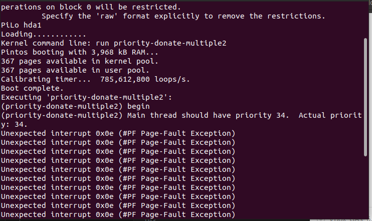
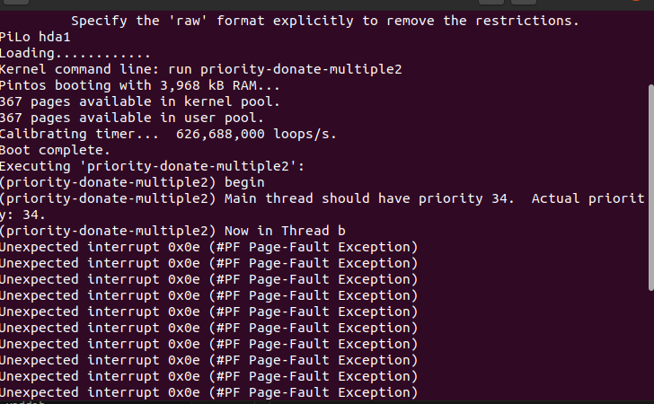

# OS实验

## Project 1

### 一、修改timer_sleep

#### 1.要求：

修改timer.c下的函数timer_sleep，使其不再忙等。

#### 2.实验思路：

##### 	①为什么会发生忙等？

```c
/*in timer.c*/ 
/* Sleeps for approximately TICKS timer ticks.  Interrupts must be turned on. */
 void
 timer_sleep (int64_t ticks)
{
	int64_t start = timer_ticks ();
	ASSERT (intr_get_level () == INTR_ON);
	while (timer_elapsed (start) < ticks)
	thread_yield();
}
```

这里的while循环，判断当前时间和开始时间start的差值（由timer_elapsed函数实现）是否小于休眠时间ticks，如果小于，就将该线程重新添加到就绪队列（thread_yield函数实现），这就导致这个线程不断地进入就绪队列，这就是忙等待。所以这里不能让这个线程进入就绪队列。通过助教给的提示，**需要调用thread_block这个函数，来将线程阻塞住**。在休眠时间过去后，再调用thread_unblock这个函数将线程恢复。

##### 	②如何确定某一blocked线程block了多久？

就需要知道这个线程blocked了多久，如果blocked时间等于ticks，那么就调用unblock，否则就继续等。每个线程需要休眠的时间不一定相同，而且开始休眠的时间也不一定相同，所以对于线程来说，这是一个专属的变量，所以需要在thread结构体中加一个休眠了多久的成员变量。采用从ticks递减到0的方法，既可以起到了记录block了多久的作用，又可以起到记录需要block多久的作用。所以需要在thread结构体中加入一个ticks_blocked成员变量。

```c
/*in thread.h*/
/*in struct thread*/
    int64_t ticks_blocked;              /* Remain sleep ticks*/
```

##### 	③如何判断一个blocked线程是否需要恢复？

由于我设置了一个ticks_blocked成员变量，当这个变量为0的时候，说明休眠结束，恢复该线程。否则就将ticks_blocked递减。

```c
/*in thread.h*/
void checkInvoke(struct thread *t, void* aux UNUSED);
```

##### 	④如何维护tick_blocked?

现在的思路是tick_blocked会随着内核的时间一起变动，也就是timer.h中的全局静态变量ticks变动而变动。纵观整个timer.c文件里，只有一个函数timer_interrupt会将ticks进行递增操作。所以到这里的时候，对所有线程进行检查，对所有在block中的线程，调用checkInvoke。

```c
static void
timer_interrupt (struct intr_frame *args UNUSED)
{
  ticks++;
  thread_tick ();
}
```

#### 3.实验过程:

##### ①初次尝试

上面的大体思路已经差不多了。接下来就是实现了。

首先，先对thread结构体进行修改:

```c
struct thread
  {
    /* Owned by thread.c. */
    tid_t tid;                          /* Thread identifier. */
    enum thread_status status;          /* Thread state. */
    char name[16];                      /* Name (for debugging purposes). */
    uint8_t *stack;                     /* Saved stack pointer. */
    int priority;                       /* Priority. */
    struct list_elem allelem;           /* List element for all threads list. */
    /* Shared between thread.c and synch.c. */
    struct list_elem elem;              /* List element. */
    int64_t ticks_blocked;              /* Remain sleep ticks*/
#ifdef USERPROG
    /* Owned by userprog/process.c. */
    uint32_t *pagedir;                  /* Page directory. */
#endif

    /* Owned by thread.c. */
    unsigned magic;                     /* Detects stack overflow. */
  };
```

就只是加了一个int64_t类型（因为那个全局静态变量ticks就是这个类型的）的ticks_blocked成员变量。

然后我们要取消在timer_sleep中的while-thread_yield循环，改成thread_block，将线程阻塞。

```c
void
timer_sleep (int64_t ticks) //根据就近原则，这个是局部变量ticks，表达的意思是休眠时间长度，而非前面全局静态变量ticks
{
  int64_t start = timer_ticks ();

  ASSERT (intr_get_level () == INTR_ON);
  // while (timer_elapsed (start) < ticks) 
  //   thread_yield ();
  //阻塞线程
  thread_block();
  //将当前线程的剩余等待时间改成ticks
  thread_current()->ticks_blocked = ticks;
}
```

这个函数修改完了，我们需要一个判断函数，使他ticks_blocked能够递减，同时还能在ticks_blocked==0的时候，调用thread_unblock来解出阻塞。

```c
void checkInvoke(struct thread *t, void* aux UNUSED){
  if(t->status == THREAD_BLOCKED && t->ticks_blocked > 0)
    t->ticks_blocked--;
  if(t->ticks_blocked == 0)
    thread_unblock(t);
}
```

当这个线程的状态是THREAD_BLOCKED的时候而且还有剩余时间的时候，剩余时间减少。如果剩余时间为零，说明休眠结束，调用thread_unblock解除休眠。

这些都完成了，就需要在timer_interrupt函数中对整个thread list进行遍历。刚开始的想法是使用thread.c中的全局静态变量all_list来遍历的，但在timer.c这个文件里使用all_list，VScode告诉我dentifier "all_list" is undefined。看了一下前面的include

```c
/*in timer.h*/
#include "devices/timer.h"
#include <debug.h>
#include <inttypes.h>
#include <round.h>
#include <stdio.h>
#include "devices/pit.h"
#include "threads/interrupt.h"
#include "threads/synch.h"
#include "threads/thread.h"
```

是因为include thread.c吗？

这个时候感谢同组的王力同学指出thread.h这个头文件里面有一个函数tread_foreach()就是一个能够对所有线程进行同一操作的函数。

```c
/* Performs some operation on thread t, given auxiliary data AUX. */
typedef void thread_action_func (struct thread *t, void *aux);
void thread_foreach (thread_action_func *, void *);
```

这样便可以对timer_interrupt进行修改了：

```c
static void
timer_interrupt (struct intr_frame *args UNUSED)
{
  ticks++;
  thread_tick ();
  thread_foreach(checkInvoke,NULL);
}
```

这样几个重要的函数都在逻辑上实现了需要的功能。在thread这个文件夹下启动terminal输入如下指令，开始测试：

```
make clean
make
cd build
pintos -- run alarm-multiple
```

这个时候，如果不出意外的话，应该是要出意外了。


直接就没办法跑起来。那没办法了，试着用下GDB吧。

##### ②GDB调试

但我发现这个和之前用的GDB不大一样，之前计算机系统使用GDB的时候一般直接对单个可执行文件就可以了，但这次pintos好像有点不一样。在查阅PKU的PintosBook的Debugging相关章节之后，我大概会了一些。主要使用如下命令：

```
pintos --gdb -- run alarm-multiple 
```

这一步先启动pintos，让terminal和QEMU处于这样的状态,此时操作系统暂停


然后再在另一个terminal中,输入以下指令

```
pintos-gdb
```


然后再使用**debugpintos**的指令,开始连接GDB和之前开启的pintos.

##### ③灵光一现

在我正准备进行GDB调试的时候，我注意了一下pintos的输出：


在thread_unblock()这个函数中assertion判断当前线程状态是否为阻塞状态失败了。扒了一下该函数的代码

```c
void
thread_unblock (struct thread *t) 
{
  enum intr_level old_level;

  ASSERT (is_thread (t));

  old_level = intr_disable ();
  ASSERT (t->status == THREAD_BLOCKED);
  list_push_back (&ready_list, &t->elem);
  t->status = THREAD_READY;
  intr_set_level (old_level);
}
```

ASSERT这个指令的作用是判断内容是否为true，非true则返回报错信息，也就是这一句输出了上面的图片的内容。那就说明在调用unblock的时候出问题了。那么什么时候调用了这个函数呢？在我的checkInvoke这个判断函数里，所以我立马翻出了这个函数的代码，看看是否存在问题。

```c
void checkInvoke(struct thread *t, void* aux UNUSED){
  if(t->status == THREAD_BLOCKED && t->ticks_blocked > 0)
    t->ticks_blocked--;
  if(t->ticks_blocked == 0)
    thread_unblock(t);
}
```

检查后，好像也没什么问题。进入这个函数，如果状态是阻塞的而且剩余阻塞时间大于0，那么说明需要继续阻塞（t->ticks_blocked--;）这个判断完后，判断如果剩余阻塞时间为0，那么就接触阻塞。乍一眼看上去逻辑上没问题。但我意识到这个里面存在一个很严重的问题：第二个if语句应该是被第一个if语句包含的，现在变成两个独立的if语句后，如果一个非blocked的线程执行checkInvoke，就会执行thread_unblock。这下就明白为什么在thread_unblock中ASSERT那句指令就会报错了。所以要么在第二个if语句增加状态判断：

```c
void checkInvoke(struct thread *t, void* aux UNUSED){
  if(t->status == THREAD_BLOCKED && t->ticks_blocked > 0)
    t->ticks_blocked--;
  if(t->status == THREAD_BLOCKED && t->ticks_blocked == 0)
    thread_unblock(t);
}
```

或者简单点：

```c
void checkInvoke(struct thread *t, void* aux UNUSED){
  if(t->status == THREAD_BLOCKED && t->ticks_blocked > 0){
    t->ticks_blocked--;
  	if(t->ticks_blocked == 0)
    	thread_unblock(t);
  }  
}
```

然后看一下结果：


##### ④渐入佳境

呃，好像还是差不多。但出问题的地方变了，而且我可以确定之前那个地方有问题，所以前面的修改确实解决了一个问题。还是看报错的那一句，在thread_block函数中intr_get_level() == INTR_OFF失败。这就说明在thread_block之前，需要使intr_get_level()==INTR_OFF.

那么就得要知道Intr_get_level这个函数是什么作用，要怎么让其返回值INTR_OFF。

在interrupt.c文件中，可以找到这个函数的定义：

```c
/* Returns the current interrupt status. */
enum intr_level
intr_get_level (void) 
{
  uint32_t flags;

  /* Push the flags register on the processor stack, then pop the
     value off the stack into `flags'.  See [IA32-v2b] "PUSHF"
     and "POP" and [IA32-v3a] 5.8.1 "Masking Maskable Hardware
     Interrupts". */
  asm volatile ("pushfl; popl %0" : "=g" (flags));

  return flags & FLAG_IF ? INTR_ON : INTR_OFF;
}
```

说实话，没看懂。但上面的注释告诉我，这个函数返回了一个当前interrupt状态。所以说，在进入thread_block之前，需要将interrupt status改成INTR_OFF。再看了看interrupt.c这个文件，有一对互逆操作intr_disable和intr_enable做到了将interrupt status改成off和on。那么只需要在进入之前，调用一下intr_disable应该就行了。

```c
void
timer_sleep (int64_t ticks) 
{
   if(ticks <= 0)
     return;
   ASSERT (intr_get_level () == INTR_ON);
  // while (timer_elapsed (start) < ticks) 
  //   thread_yield ();
  intr_disable ();
  thread_current()->ticks_blocked = ticks;
  thread_block();
 }
```


又在timer_sleep里ASSERT报错了，这里就很清楚了，因为我写的timer_sleep只有一个地方有ASSERT，我只将interrupt status改成INTR_OFF，并没有恢复。所以下一次再访问timer_sleep后，还是在INTR_OFF，所以会报错。秉持着遇到问题就解决提出问题的人，我们只需要把那一句，ASSERT (intr_get_level () == INTR_ON);直接删掉不久好了吗？


你别说，你还真别说还真可以。XD

不耍宝了，为了其他功能的正常进行，我们还是要把interrupt status进行复原。用intr_enable();就行了。最终的timer_sleep如下：

```c
/* Sleeps for approximately TICKS timer ticks.  Interrupts must
   be turned on. */
void
timer_sleep (int64_t ticks) 
{
   if(ticks <= 0)
     return;

  ASSERT (intr_get_level () == INTR_ON);
  // while (timer_elapsed (start) < ticks) 
  //   thread_yield ();
  intr_disable ();
  thread_current()->ticks_blocked = ticks;
  thread_block();
  intr_enable();
}
```

最后终于可以实现运作了。

#### 4.实验结果：

##### ①代码：

###### thread结构体

```c
struct thread
  {
    /* Owned by thread.c. */
    tid_t tid;                          /* Thread identifier. */
    enum thread_status status;          /* Thread state. */
    char name[16];                      /* Name (for debugging purposes). */
    uint8_t *stack;                     /* Saved stack pointer. */
    int priority;                       /* Priority. */
    struct list_elem allelem;           /* List element for all threads list. */
    /* Shared between thread.c and synch.c. */
    struct list_elem elem;              /* List element. */
    int64_t ticks_blocked;              /* Remain sleep ticks*/
#ifdef USERPROG
    /* Owned by userprog/process.c. */
    uint32_t *pagedir;                  /* Page directory. */
#endif

    /* Owned by thread.c. */
    unsigned magic;                     /* Detects stack overflow. */
  };
```

###### timer_sleep

```c
/* Sleeps for approximately TICKS timer ticks.  Interrupts must
   be turned on. */
void
timer_sleep (int64_t ticks) 
{
   if(ticks <= 0)
     return;

  ASSERT (intr_get_level () == INTR_ON);
  // while (timer_elapsed (start) < ticks) 
  //   thread_yield ();
  intr_disable ();
  thread_current()->ticks_blocked = ticks;
  thread_block();
  intr_enable();
}
```

###### timer_interrupt

```c
static void
timer_interrupt (struct intr_frame *args UNUSED)
{
  ticks++;
  thread_tick ();
  thread_foreach(checkInvoke,NULL);
}
```

###### checkInvoke

```
void checkInvoke(struct thread *t, void* aux UNUSED){
  if(t->status == THREAD_BLOCKED && t->ticks_blocked > 0){
    t->ticks_blocked--;
  	if(t->ticks_blocked == 0)
    	thread_unblock(t);
  }  
}
```

##### ②实验结果：


可以看到，实验要求的结果应该是对于相同的product的组，其线程号应该是递增的。我做出来的结果确实也符合这一结果。

##### ③小结和反思：

1. 首先是最关键的问题，这个实验自己写的成分有多少。说实话，一开始没什么思路，什么时候有思路的呢？看着老师发群里的PPT后面几页，看完豁然开朗，直接就有动力开写了。所以说思路确实不完全是我自己想的，但内部的代码实现，都是我自己一步一步试过来的。
2. 关于Block_list实现的可能性，有，而且很大，但不好实现，因为需要改的东西有点多，至少需要多改两个函数thread_block(需要把线程从ready_list中删掉，并把线程加入到block_list)和thread_unblock(需要把线程从block_list中删去，加入到ready_block里)，别的应该和对all_list进行操作没有区别。通过维护一个block_list，并不是一定是效率的提升，我觉得这个里面还是有trade-off的，因为需要不断地对两个链表进行增加和删减的操作，但可以少判断一些不在block的线程。
3. 关于那个timer_sleep中interrupt status改变，我是通过程序的报错来发现的。但是，现在我有一个新的解释，因为我发现这个进入前intr_disable，退出后intr_enable，很像防止临界区冲突的一个解决方案。我要将这个线程block，此时就不应该发生中断。等我将这个线程block完成后，释放了这个锁，就可以发生中断。

### 二、实现优先级调度

#### 1.要求：

- 能够完成CPU优先级调度算法，实现alarm-priority以降序输出。
- 

#### 2.实验思路

##### ①怎么实现优先级调度？

​	从上一个Task我们可以知道，整个系统的线程依靠两个双链表来维护。在未修改时，所有线程都会插入到链表的尾部。而每次执行的都是链表头的那个线程。所以我们只需要将这个链表维护好，使其成为一个有序的链表，排序的标准就是按照优先级向下排序。

##### ②哪些行为会对链表进行操作？

​	首先是一个线程刚被创建时init_thread()函数会将线程插入all_list，其次在thread_yield()中，会将线程放进ready_list，最后当线程解除block时，也就是unblock时，会将线程放入ready_list里

#### 3.实验过程：

##### ①初次尝试

​	init_thread、thread_yield和thread_unblock中，最后都用了一个list_push_back将线程插入到相应的队列的尾部。而要使链表有序，就不应该这么做，我们需要让其插入到有序的位置。所以，要么就对整个队列进行排序，要么每次插入的时候，都使要插入的线程的优先级比前面的小，比后面的大。这里我采用后面这种方法，首先实现起来方便，其次效率也更高。

​	刚好，在list.h这个文件里，给了我们一个函数list_insert_ordered():

```c
void
list_insert_ordered (struct list *list, struct list_elem *elem,
                     list_less_func *less, void *aux)
{
  struct list_elem *e;

  ASSERT (list != NULL);
  ASSERT (elem != NULL);
  ASSERT (less != NULL);

  for (e = list_begin (list); e != list_end (list); e = list_next (e))
    if (less (elem, e, aux))
      break;
  return list_insert (e, elem);
}
```

这个函数根据less这个函数来确定需要插入的位置，而这个less需要我们自己编写。

所以就先从这个函数开始入手：

```c
bool thread_cmp(const struct list_elem *a, const struct list_elem *b, void *aux UNUSED)
{
  int offset = *(int*)aux;
  int *valueOfa = (int*)((char*)a + offset);
  int *valueOfb = (int*)((char*)b + offset);
  return *valueOfa > *valueOfb;
}
```

这里通过aux来传递一个offset，是thread结构体中priority成员到thread头部的距离，可以通过这个来获得priority的地址，然后再进行比较。

这个函数写完了，我们再需要将list_push_back替换成list_insert_ordered。

```c
//init_thread:
 list_insert_ordered (&all_list, &t->allelem, (list_less_func *) &thread_cmp, offsetof(struct thread,priority));
//thread_yield:
list_insert_ordered (&ready_list, &t->elem, (list_less_func *) &thread_cmp, offsetof(struct thread,priority));
//thread_unblock:
list_insert_ordered (&ready_list, &t->elem, (list_less_func *) &thread_cmp, offsetof(struct thread,priority));
```

然后润一下


果然出问题了，直接就报错了。思路上来说，应该没问题，但应该哪里搞错了。

经过长久的查错，我终于发现哪里有问题了，这个问题出在init_thread里：

```c
static void
init_thread (struct thread *t, const char *name, int priority)
{
  enum intr_level old_level;

  ASSERT (t != NULL);
  ASSERT (PRI_MIN <= priority && priority <= PRI_MAX);
  ASSERT (name != NULL);

  memset (t, 0, sizeof *t);
  t->status = THREAD_BLOCKED;
  strlcpy (t->name, name, sizeof t->name);
  t->stack = (uint8_t *) t + PGSIZE;
  t->priority = priority;
  t->magic = THREAD_MAGIC;

  old_level = intr_disable ();
  list_insert_ordered (&all_list, &t->allelem, (list_less_func *) &thread_cmp_priority, offsetof(struct thread,priority));
  intr_set_level (old_level);
}
```

这个错误太低级了，但是太难发现了。这里我加进去的list_insert_ordered中priority，按我的想法，应该是thread中identifier为priority的成员，但是这个函数里的signature已经有一个同名的priority，所以这里的priority会自动认定为一个int变量。所以要避免这个事情发生，我的想法是将这个offset拿出来，成为一个全局变量。

```c
int thread_priority_ofs = offsetof(struct thread, priority);

//init_thread:
 list_insert_ordered (&all_list, &t->allelem, (list_less_func *) &thread_cmp, &thread_priority_ofs);
//thread_yield:
list_insert_ordered (&ready_list, &t->elem, (list_less_func *) &thread_cmp, &thread_priority_ofs);
//thread_unblock:
list_insert_ordered (&ready_list, &t->elem, (list_less_func *) &thread_cmp, &thread_priority_ofs);
```

这下应该没什么问题了吧。


呃，呃呃了。还是不行。为什么呢？

我准备开始跟踪着看看，我在比较函数里，把两个线程的priority和offset都输出一下，看看有没有问题。


啊？两个线程的priority都是0？

最新进展：我重新看了一遍thread结构体的定义和list_elem结构体的定义，以及插入列表的函数。我发现了我一直以来的一个误区，那就是我一直以为链表的每个节点都是thread结构体，我在比较函数里面拿到的就是thread的首地址，这样我就可以通过一个offset就能拿到priority的地址和priority的值。但是事情并不是这样的，挂在链表上的其实是list_elem，而这个每个list_elem又是各自的thread的成员，就好像晾衣服，list_elem上挂着衣服然后再挂到list这个晾衣绳上，显然，衣架并不是衣服。所以接下来的任务，是从list_elem去找到thread，然后再进一步去找priority。

但是其实，直接根据elem和priority的相对位置就能直接找到priority。

```c
int priority_elem_ofs = offsetof(struct thread, priority) - offsetof(struct thread, elem);
int priority_allelem_ofs = offsetof(struct thread, priority) - offsetof(struct thread, allelem);
```

就是这两个全局变量了。因为一个thread是有可能会挂在两个list上的，一个由allelem构成的all_list和一个由elem构成的ready_list，所以需要有两个。

然后就是比较函数，其实差不多。

```c
bool thread_cmp (const struct list_elem *a, const struct list_elem *b, void *aux UNUSED)
{

  int offset = *(int*)aux;
  int *valueOfa = (int*)((char*)a + offset);
  int *valueOfb = (int*)((char*)b + offset);
  return *valueOfa > *valueOfb;
}
```

然后需要稍微修改一下输入的参数。

```c
//init_thread:
 list_insert_ordered (&all_list, &t->allelem, (list_less_func *) &thread_cmp, &priority_allelem_ofs);
//thread_yield:
list_insert_ordered (&ready_list, &t->elem, (list_less_func *) &thread_cmp, &priority_elem_ofs);
//thread_unblock:
list_insert_ordered (&ready_list, &t->elem, (list_less_func *) &thread_cmp, &priority_elem_ofs);
```


同小组王力同学采用了使用宏list_entry的方法，看了一下，感觉我自己好多功夫其实都是无用功。怎么说呢？有人就是享受这种折磨自己的感觉吧。不过我好像看出他的比较函数好像有些问题，因为他只写了一个针对elem（对应了ready_list队列）的排序，即使是传进来的是allelem，也是使用这个函数，这样难道不会导致all_list出问题吗？但他却也能正常运行。好奇怪啊。而且看list_insert_ordered上面注释也讲了，需要根据aux来辅助比较，他的比较函数里aux是UNUSED的。不过我也还没有问他，有可能他也同样写了一个allelem的函数，只是我没看到。哎，什么时候讨论一下吧。

接下来，还有一个问题，就是现在的优先级调度并不支持抢占。

前面的都完成了，这个解决起来就比较简单了。只需要解决一个问题：什么时候会发生抢占呢？

无非就是两种情况：

1. 一个进程新建的时候。
2. 进程的优先级被修改的时候。

所以只需要对这两个地方对应的`thread_create()`和`thread_set_priority()`进行修改就行了。只需要在执行结束时，主动放弃CPU，待调度程序重新挑选CPU进行执行就可以了。

也即是在这两个函数最后加上一句`thread_yield`就可以轻松解决了。

这样，第一小步终于结束了。该想办法怎么通过优先级捐赠（个人比较喜欢优先级继承这个名字）来解决优先级反转的问题了。


#### 4.实验结果

##### ①代码

##### ②实验结果：

##### ③小结和反思：

- 首先是对第一步实现优先级调度，只能说，感觉一半时间在和整个那个list做斗争，一半时间在和指针在做斗争。只能说C语言指针没学好暴露了。虽然没写出来比较函数里面各种的格式转化，比如如何把list_elem结构体的指针转化成一个可以比较的int类型的priority。可能在实验报告里面看起来很轻松，但是其实都是在网上查了许多博客之后才写出来的。

### 三、解决优先级反转的问题

#### 1.要求：

1. 解决优先级反转。

#### 2.实验思路：

##### ①什么是优先级反转？

优先级反转就是当一个低优先级进程持有互斥锁，而高优先级进程也在请求这一互斥锁，所以高优先级被阻塞。此时而低优先级进程竞争不过其他的中优先级进程，所以出现中优先级进程优先执行，高优先级进程被阻塞的情况。

##### ②如何解决优先级反转？

基本思路就是提高低优先级进程的优先级，让占有锁的低优先级进程先执行。完成后会释放锁供高优先级进程使用。最简单的方法就是将低优先级进程的优先级提至最高。但这样就会导致中优先级和低优先级发生互斥的时候，高优先级会被阻塞。所以Pintos采用了一种更合理的方法——优先级捐赠。将高优先级的优先级捐给低优先级进程，使其优先级高于中优先级进程，同时又避免了低优先级进程抢占更高优先级进程。

##### ③在什么时候进行优先级捐赠？

按照优先级反转的定义，我们可以知道这一问题发生在互斥访问的时候。当某个进程申请锁的时候，如果这个锁的拥有进程的优先级低于申请的进程，就会进行优先级捐赠。

##### ④可能会出现的特殊情况：

1. 有可能出现一个锁1被某个进程1持有，但这个进程完成执行又需要另一个锁2，而锁2被进程2持有的，以此类推进而形成一条链的情况。
2. 有可能出现一个进程持有多个锁，所以可能会有多个进程对其进行捐赠。

对于情况1，我们需要不断地向这条链上的进程进行优先级捐赠，直到尾部的进程执行完，释放了锁，然后从后往前逐步释放锁。

对于情况2，对于多对一捐赠，我们需要取优先级最高的进程所捐赠的优先级。

##### ⑤释放锁后应该怎么做？

如果只有一个进程捐赠，释放锁后，应该回到原来的优先级。(如果不变回的话，优先级就发生了改变，低优先级进程就成了高优先级进程了)

如果有多个进程捐赠，释放锁后，应该将优先级变成剩下的进程中最高的那个。

这也就说明，我们可能需要一个结构来存储某个线程被多少个进程捐赠了优先级，因为无法确定究竟需要多少大小，所以一个链表显然优于一个数组。同时还需要一个成员变量来记录这个进程原来的优先级，以便恢复优先级。

#### 3.实验过程

##### ①对结构体进行修改

主要增加了一个int类型成员变量`origin_priority`用于记录未被捐赠时进程的优先级。此外，我们还需要一个链表，用于存储捐赠的优先级。现在有两个思路，一个是存储捐赠了优先级的进程，另一个是存储当前线程持有的锁。那么那种方案比较合适呢？进程的话，优先级比较直观，当一个锁释放的时候，需要将所有申请这个锁的进程从链表上移出；但若是锁，就是这个锁释放时候，将锁移出就行了。但无论是哪种方法，在释放锁后应该在剩下的选择一个最大的优先级作为此后的优先级。

经过我的思考后，我选择采用lock的链表，而不是thread的链表，理由如下：

1. 是哪个thread捐赠的并不重要，重要的是捐赠的优先级，所以完全可以在锁里增加一个最大的优先级，来记录到目前为止捐赠的最大优先级，以此就可以完全不用管其他线程。
2. 此外，如果用thread，需要对结构体进行的修改，除了`origin_priority`以外，我们还需要一个链表之外还需要一个lock的指针来指向其申请的锁。而lock的话，只需要一个链表就可以了。最大的优先级可以由锁自己来保管。

除了这个，我们还需要一个lock_waiting，来记录当前线程正在请求哪个锁，方便实现优先级的传递。

首先需要对thread结构体进行修改

```c
struct thread
  {
    /* Owned by thread.c. */
    tid_t tid;                          /* Thread identifier. */
    enum thread_status status;          /* Thread state. */
    char name[16];                      /* Name (for debugging purposes). */
    uint8_t *stack;                     /* Saved stack pointer. */
    int origin_priority;				/* Original priority */
    int priority;                       /* Priority. */
    struct list holding_locks;			/* Locks held by this thread */
    struct lock* lock_waiting;			/* Waiting for the lock */
    struct list_elem allelem;           /* List element for all threads list. */
    /* Shared between thread.c and synch.c. */
    struct list_elem elem;              /* List element. */
    int64_t ticks_blocked;              /* Remain sleep ticks*/
#ifdef USERPROG
    /* Owned by userprog/process.c. */
    uint32_t *pagedir;                  /* Page directory. */
#endif

    /* Owned by thread.c. */
    unsigned magic;                     /* Detects stack overflow. */
  };
```

然后就是lock的结构体也需要修改

```c
struct lock 
  {
    int max_priority;
    struct list_elem elem;
    struct thread *holder;      /* Thread holding lock (for debugging). */
    struct semaphore semaphore; /* Binary semaphore controlling access. */
  };
```

主要就是一个`max_priority`来保管捐赠的最高优先级。如果是未被任何进程持有的锁，应该保证`max_priority`为最低的优先级。以便被进程占有的时候，可以设置为当前进程的优先级，方便其他进程进行优先级比较。

还有一个list_elem类型的elem，用于将lock连接到holding_locks的链表上。

既然结构体发生了变化，其初始化函数一定就要做出相应的更改。

```c
static void
init_thread (struct thread *t, const char *name, int priority)
{
  enum intr_level old_level;

  ASSERT (t != NULL);
  ASSERT (PRI_MIN <= priority && priority <= PRI_MAX);
  ASSERT (name != NULL);

  memset (t, 0, sizeof *t);
  t->status = THREAD_BLOCKED;
  strlcpy (t->name, name, sizeof t->name);
  t->stack = (uint8_t *) t + PGSIZE;
  t->priority = priority;
  t->magic = THREAD_MAGIC;
  t->origin_priority = priority;
  list_init(&t->holding_locks);
  old_level = intr_disable ();
  list_insert_ordered (&all_list, &t->allelem, (list_less_func *) &thread_cmp_priority, &priority_allelem_ofs);
  intr_set_level (old_level);
}
```

```c
void
lock_init (struct lock *lock)
{
  ASSERT (lock != NULL);
  lock->
  lock->holder = NULL;
  sema_init (&lock->semaphore, 1);
}
```

##### ②申请锁

我准备按照事情发生的顺序来写，所以要是整件事开始发生，第一件事情就是有进程申请锁，即调用了`lock_acquire`。

```c
void
lock_acquire (struct lock *lock)
{
  ASSERT (lock != NULL);
  ASSERT (!intr_context ());
  ASSERT (!lock_held_by_current_thread (lock));
//前
  sema_down (&lock->semaphore);
//后
  lock->holder = thread_current ();
}
```

首先，如果这个锁是空闲的，进程就不会在sema_down这一句内被阻塞，而是会出去执行lock->holder；所以我们需要在`sema_down`这一句之后做两件事：

1. 把该锁连接到holding_locks上
2. 修改这个锁的优先级。

如果这个锁是被占有的，进程就会在sema_down这一句被阻塞。阻塞的时候，就需要进行判断是否进行优先级捐赠了，若当前进程的优先级大于锁的最大优先级，就把锁的最大优先级进行修改。

所以我在想，既然两种情况都需要对锁的优先级进行修改，那么不妨就在`sema_down`前，就把锁的优先级修改了。

```c
void
lock_acquire (struct lock *lock)
{
  struct thread* current_thread = thread_current();
  struct thread* holder = lock->holder;
  int priority = thread_current()->priority;

  ASSERT (lock != NULL);
  ASSERT (!intr_context ());
  ASSERT (!lock_held_by_current_thread (lock));
  
  do{
    if(priority > lock->max_priority){
      lock->max_priority = priority;
    }else{
      priority = lock->max_priority;
    }
    holder = lock->holder;
  }while(holder != NULL);

  sema_down (&lock->semaphore);
    
  list_insert_ordered(&current_thread->holding_locks,&lock->elem, lock_cmp_priority, max_priority);
    
  lock->holder = thread_current ();
}
```

这个就是第一版的做法，但是存在很大问题，主要实现的是一个思路上，很明显是跑不起来的。在前后，我准备将其写成两个函数来封装。首先，在`sema_down`之前，进行优先级捐赠。在`sema_down`之后，把锁连到占有链表上。前一个do循环，可以采用递归的方式，将优先级捐赠，同时满足如果是申请空闲的锁，就直接把自身的priority给锁。后一个insert也把其封装成一个函数，保证其原子操作。


思考一个问题，只要实现了优先级捐赠，最下面这张图是不是不可能会存在？优先级为4的进程已经申请了锁后，无论这个锁是否被持有，都不会轮到优先级为3的进程进行锁的申请。从更深的角度来看，是否当前进程的优先级和锁的最大优先级进行比较是不需要的，因为对于单CPU系统来说，优先级调度一定会执行未被阻塞的优先级最高的进程，所以能请求锁的进程，其优先级一定大于或等于当前占有锁的进程。但是，我还是有点不确定，所以我准备按照最稳的方法来，还是比较一下优先级，保持锁的优先级为最高的优先级。

```c
void
lock_acquire (struct lock *lock)
{
  struct thread* current_thread = thread_current();
  struct thread* holder = lock->holder;
  int priority = thread_current()->priority;

  ASSERT (lock != NULL);
  ASSERT (!intr_context ());
  ASSERT (!lock_held_by_current_thread (lock));

  thread_donate_priority(lock);

  sema_down (&lock->semaphore);
  
  lock->holder = thread_current ();
}
```

然后`thread_donate_priority`函数我采用了一个递归调用的函数，只要不是未被占有的锁，就将当前线程的waiting改为这个锁，并调用递归。

关于递归，递归终点是某个进程不等待锁，就可以正常执行或者某个进程的优先级比前面的进程优先级还大，就无需捐赠了。其他时候将锁的优先级改成现在进程的优先级（因为此时条件是lock!=NULL&&thread_current()->priority <= lock->max_priority），然后更新锁的持有者的优先级，如果其在就绪队列中，因为优先级的改变，所以就需要重新对ready_list进行排序，保证调度程序的正确执行。

```c
void thread_donate_priority(struct lock* lock){
  enum intr_level old_level = intr_disable ();
  if(lock->holder != NULL){
    thread_current()->waiting = lock;
    thread_donate_priority_recursion(lock);
  }
   intr_set_level (old_level);
}

void thread_donate_priority_recursion(struct lock* lock){
  if(lock == NULL || thread_current()->priority <= lock->max_priority){
    return;
  }else{
    lock->max_priority = thread_current()->priority;
    thread_update_priority (lock->holder);
      if (lock->holder->status == THREAD_READY){ 
        list_remove (&lock->holder->elem);
        list_insert_ordered (&ready_list, &lock->holder->elem, thread_cmp_priority, &priority_elem_ofs);
      }
    thread_donate_priority_recursion(lock->holder->waiting);
  }
}
```

这里还新加了一个thread_update_priority函数，目的是从thread持有的锁中选出最大优先级的锁来更新其优先级。除了这里会用到，待会的释放锁也需要用到。

大致思路是，如果当前没有持有锁，就恢复为原优先级。如果持有，就将链表中拥有最大优先级（这里就是链表的第一个元素）的锁的优先级和线程自身的原优先级进行比较，选择二者的最大值作为之后的优先级。

```c
void thread_update_priority (struct thread *thread){
  enum intr_level old_level = intr_disable ();
    
  if(list_empty(&thread->holding_locks)){
    thread->priority = thread->origin_priority;
  }else{
    list_sort(&thread->holding_locks,lock_cmp_priority,&lock_priority_elem);
    thread->priority = MAX(thread->origin_priority,list_entry(list_front (&thread->holding_locks), struct lock, elem)->max_priority);
  }

  intr_set_level (old_level);
}
```

然后这里有涉及到list_sort里面需要用的优先级比较了`lock_cmp_priority`。

```c
bool lock_cmp_priority (const struct list_elem *a, const struct list_elem *b, void *aux UNUSED)
{
  int offset = *(int*)aux;
  int *valueOfa = (int*)((char*)a + offset);
  int *valueOfb = (int*)((char*)b + offset);
  return *valueOfa > *valueOfb;
}
int lock_priority_elem = offsetof(struct lock, max_priority) - offsetof(struct lock, elem);
```

应该和前面`thread_cmp_priority`是一样的，所以这里只需要改个头就行了。这里的aux就是采用类似的`lock_priority_elem`就可以了。

好了，现在完成一半了，我们还需要实现成功拿到锁后续处理。

首先，先把当前线程等待锁改成NULL，因为有可能是阻塞了，最后成功拿到锁的线程，也有可能是直接申请到的。但无论是哪种情况，改回去总是不亏的。然后将锁的最大优先级改成当前线程的优先级，以备下一次优先级捐赠。然后再修改当前线程的holding_locks，将这个锁连接到链表上。

```c
//后
thread_current()->waiting = NULL;
lock->max_priority = thread_current()->priority;
list_insert_ordered (&thread_current ()->holding_locks, &lock->elem, lock_cmp_priority, lock_priority_elem);
```

这样仅对申请锁就实现的差不多了，好难，做了很久，但是还是没做完，而且还得等释放锁做完才能进行测试，感觉有很多还没做好的地方，但是现在又想不到是哪里有问题。就先继续做下去吧。

##### ③释放锁

释放锁，好像就不需要考虑太多的东西了，就只要做好两件事：一、修改holding_locks，维护链表；二、更新线程的优先级，这个我们已经用`thread_update_priority`函数来实现了，所以只需要修改holding_locks

```c
void thread_remove_lock(struct lock* lock){
  enum intr_level old_level = intr_disable ();
  list_remove (&lock->elem);
  thread_update_priority (thread_current ());
  intr_set_level (old_level);
}
```

然后，好像这样就好了。

接着我就开始make了一下，报了几个简单的语法错误，我就不赘述了。然后我试着运行了一下priority-donate-one这个测试用例，出现如下情况。


##### ④解决问题

我先是测试用了单个测试，发现捐赠的priority就有问题，似乎就没有捐赠成功。所以我准备先返回看一看优先级捐赠那一部分。


然后我又在初始化那里加入了一个printf，输出初始化后的thread的优先级，但是


出现了这种情况，再看了看priority-donate-one的代码

```c
void
test_priority_donate_one (void)
{
  struct lock lock;

  /* This test does not work with the MLFQS. */
  ASSERT (!thread_mlfqs);

  /* Make sure our priority is the default. */
  ASSERT (thread_get_priority () == PRI_DEFAULT);

  lock_init (&lock);
  lock_acquire (&lock);
  //printf("lock is held by %s\n",&lock.holder->name);
  thread_create ("acquire1", PRI_DEFAULT + 1, acquire1_thread_func, &lock);
  msg ("This thread should have priority %d.  Actual priority: %d.",
       PRI_DEFAULT + 1, thread_get_priority ());
  thread_create ("acquire2", PRI_DEFAULT + 2, acquire2_thread_func, &lock);
  msg ("This thread should have priority %d.  Actual priority: %d.",
       PRI_DEFAULT + 2, thread_get_priority ());
  lock_release (&lock);
  msg ("acquire2, acquire1 must already have finished, in that order.");
  msg ("This should be the last line before finishing this test.");
}
```

第一个ASSERT没有出错，说明在申请锁之前，优先级是没问题，是PRI_DEFAULT(31)，是在优先级捐赠上出了问题。

然后我又在我的thread_donate_priority这个函数上加了一句print表示进入了这个函数，但在实际运行的过程中没有出现这个输出，所以我可以肯定一个原因是没有进入这个函数，也就是没有进行优先级捐赠。那么判断条件if(lock->holder != NULL && !thread_mlfqs)就很暧昧了，两个必须满足其中一个，我也是分开测试了一下，发现如果lock_acquire这个函数动用printf就会导致整个系统崩溃，thread_mlfqs这个会出现，而lock->holder就不会。说明在申请完成后，并没有把lock->holder进行修改。但是，我又在测试用例的lock_acquire后又加上了printf来打印锁的持有者，是能够正确显示的，说明持有锁没有问题。这就非常奇怪了。


可以看到，锁确确实实被main这个thread持有了。但是就是没有显示。然后我又对priority-donate-one这个测试文件进行修改，发现这个acquire1这个线程根本就没有进入acquire1_thread_func这个函数。这是为什么？很快，我就想到了为什么，在这张图里我们可以看到，acquire1和acquire2确实是被创建出来了，但是acquire1和acquire2却没有被得到执行，实际上一直执行的是main这个线程。这说明了什么，我们的优先级调度还没实现抢占，我们需要在create和set后面，交出控制权，让系统重新选择优先级最高的线程。

```c
void
thread_set_priority (int new_priority) 
{
  if(thread_mlfqs)
    return;
  enum intr_level old_level = intr_disable ();
  struct thread *current_thread = thread_current ();
  int old_priority = current_thread->priority;
  current_thread->original_priority = new_priority;

  if (list_empty (&current_thread->holding_locks) || new_priority > old_priority)
  {
    current_thread->priority = new_priority;
    thread_yield ();
  }
   intr_set_level (old_level);
}
```

```c
tid_t
thread_create (const char *name, int priority,
               thread_func *function, void *aux) 
{
  struct thread *t;
  struct kernel_thread_frame *kf;
  struct switch_entry_frame *ef;
  struct switch_threads_frame *sf;
  tid_t tid;

  ASSERT (function != NULL);

  /* Allocate thread. */
  t = palloc_get_page (PAL_ZERO);
  if (t == NULL)
    return TID_ERROR;

  /* Initialize thread. */
  init_thread (t, name, priority);
  tid = t->tid = allocate_tid ();

  /* Stack frame for kernel_thread(). */
  kf = alloc_frame (t, sizeof *kf);
  kf->eip = NULL;
  kf->function = function;
  kf->aux = aux;

  /* Stack frame for switch_entry(). */
  ef = alloc_frame (t, sizeof *ef);
  ef->eip = (void (*) (void)) kernel_thread;

  /* Stack frame for switch_threads(). */
  sf = alloc_frame (t, sizeof *sf);
  sf->eip = switch_entry;
  sf->ebp = 0;

  t->ticks_blocked = 0;
  /* Add to run queue. */
  thread_unblock (t);
  if (thread_current ()->priority < priority)
   {
     thread_yield ();
    }

  return tid;
}
```

然后测试priority-preempt和priority-change，发现都成功了。


然后我们再来试一试，


可以看到可以看到，成功进入了acuire1了，优先级的捐赠也没有问题，但还是存在错误。main释放锁之后，还是没有轮到acuire1和acuire2来执行，我估计这是因为在释放锁后，修改了优先级，但是没有把执行交给高优先级的进程。所以是否在release后加上一句thread_yield()就行了。


可以正常结束，但是还有问题，看这张截图就能看出端倪了，acquire1先拿到了锁先释放，由于yield之后不会执行输出done那一语句，再由2拿到锁再释放，2输出done，然后1输出done。所以还是main释放锁之后优先级的调度上出了问题。


可是我已经把前面写过的能影响优先级的程序都检查了一遍，都没有问题。然后我又试着在acquire1内输出前后的线程，发现一个是main(31)在acquire1(32)后面，还有一个前面的是乱码。又试了试两个next的，也就是main后面的，也乱码。那么acquire2又到哪里去了呢？

acquire2得不到锁，不在ready队列里，显然是被移出去了，也就是阻塞了，但是在哪里把它阻塞了呢？想到这，我又看了一眼sema_up和sema_down，终于找到了问题的所在。在sema_down的函数里，有一个list_push_back将等待的线程放到信号量的等待队列并将其阻塞。然后在sema_up中解除阻塞。因为是1先申请的锁，所以采用list_push_back的方法，最后出来的会是acquire1而不是优先级高的acquire2，在1释放锁之前，2一直等在这里。所以很简单，list_push_back改成list_insert_ordered就行了。

```c
void
sema_down (struct semaphore *sema) 
{
  enum intr_level old_level;

  ASSERT (sema != NULL);
  ASSERT (!intr_context ());

  old_level = intr_disable ();
  while (sema->value == 0) 
    {
      list_insert_ordered (&sema->waiters, &thread_current ()->elem,thread_cmp_priority_v2,NULL);
      thread_block ();
    }
  sema->value--;
  intr_set_level (old_level);
}
```

这里thread_cmp_priority_v2，采用的是利用list_entry这个函数的方法，适用性要比我之前写的那个更好。之前那个我把定位的全局变量放到thread.c这个文件里了，导致别的文件识别不了，放到.c文件里又会报错，所以采用了这个。


可以看到，2先申请锁释放后交给了1。然后把我在priority-donate-one.c文件里面写的测试语句删掉，再make后run一下


可以看到符合预期，然后再make tests/threads/priority-donate-one.result


OK，成功PASS。然后再试一试其他几个


###### multiple通过

###### **multiple2卡住了**


###### nest通过

###### sema不行


###### lower过了


###### fifo通过


###### chain卡住

所以接下来，还需要针对性解决这三个按理：

我们先来看multiple2

##### ⑤逐个攻破

```c
void
test_priority_donate_multiple2 (void)
{
  struct lock a, b;

  /* This test does not work with the MLFQS. */
  ASSERT (!thread_mlfqs);

  /* Make sure our priority is the default. */
  ASSERT (thread_get_priority () == PRI_DEFAULT);

  lock_init (&a);
  lock_init (&b);

  lock_acquire (&a);
  lock_acquire (&b);

  thread_create ("a", PRI_DEFAULT + 3, a_thread_func, &a);
  msg ("Main thread should have priority %d.  Actual priority: %d.",
       PRI_DEFAULT + 3, thread_get_priority ());

  thread_create ("c", PRI_DEFAULT + 1, c_thread_func, NULL);

  thread_create ("b", PRI_DEFAULT + 5, b_thread_func, &b);
  msg ("Main thread should have priority %d.  Actual priority: %d.",
       PRI_DEFAULT + 5, thread_get_priority ());

  lock_release (&a);
  msg ("Main thread should have priority %d.  Actual priority: %d.",
       PRI_DEFAULT + 5, thread_get_priority ());

  lock_release (&b);
  msg ("Threads b, a, c should have just finished, in that order.");
  msg ("Main thread should have priority %d.  Actual priority: %d.",
       PRI_DEFAULT, thread_get_priority ());
}

static void
a_thread_func (void *lock_)
{
  struct lock *lock = lock_;

  lock_acquire (lock);
  msg ("Thread a acquired lock a.");
  lock_release (lock);
  msg ("Thread a finished.");
}

static void
b_thread_func (void *lock_)
{
  struct lock *lock = lock_;

  lock_acquire (lock);
  msg ("Thread b acquired lock b.");
  lock_release (lock);
  msg ("Thread b finished.");
}

static void
c_thread_func (void *a_ UNUSED)
{
  msg ("Thread c finished.");
}
```

然后这是我的运行结果



可以看到，申请了锁a，b后，然后创建线程a并成功进行了优先级捐赠，然后有两种可能，线程c创建或为创建。个人倾向与c成功创建，但是优先级32比34要低，创建了但是没有执行。然后又有一个线程b(36)来申请锁b，然后就出错了。估计是这样，我选择在b申请锁前打印一条语句看一下推断是否正确。



推断没问题，说明就是进程b申请了锁b，然后出问题了 。但是为什么会出错呢？

我又在我的thread_donate_priority函数中几个节点打印了输出，发现问题出现在`     list_insert_ordered(&ready_list,&lock->holder->elem,thread_cmp_priority,priority_elem_ofs);`这句代码上，然后我就发现了一个低级的错误，我的priority_elem_ofs前面没有加取地址符&。所以要么就加上就完事了，要么就用我前面写的v2


可以看到，没报错，然后把我写在priority_donate_multiple2中的都打印语句都注释掉。然后再测试一遍


可以看到成功pass了。连带着chain也过了


但是sema还是卡住了，我们再继续看sema的测试代码

```c
void
test_priority_donate_sema (void)
{
  struct lock_and_sema ls;

  /* This test does not work with the MLFQS. */
  ASSERT (!thread_mlfqs);

  /* Make sure our priority is the default. */
  ASSERT (thread_get_priority () == PRI_DEFAULT);

  lock_init (&ls.lock);
  sema_init (&ls.sema, 0);
  thread_create ("low", PRI_DEFAULT + 1, l_thread_func, &ls);
  thread_create ("med", PRI_DEFAULT + 3, m_thread_func, &ls);
  thread_create ("high", PRI_DEFAULT + 5, h_thread_func, &ls);
  sema_up (&ls.sema);
  msg ("Main thread finished.");
}

static void
l_thread_func (void *ls_)
{
  struct lock_and_sema *ls = ls_;

  lock_acquire (&ls->lock);
  msg ("Thread L acquired lock.");
  sema_down (&ls->sema);
  msg ("Thread L downed semaphore.");
  lock_release (&ls->lock);
  msg ("Thread L finished.");
}

static void
m_thread_func (void *ls_)
{
  struct lock_and_sema *ls = ls_;

  sema_down (&ls->sema);
  msg ("Thread M finished.");
}

static void
h_thread_func (void *ls_)
{
  struct lock_and_sema *ls = ls_;

  lock_acquire (&ls->lock);
  msg ("Thread H acquired lock.");

  sema_up (&ls->sema);
  lock_release (&ls->lock);
  msg ("Thread H finished.");
}
```


先盘一下运行的逻辑，main先创建一个lock&sema，sema初始值为0。然后依次次创建3个进程L、M、H。但是L创建时，会占有锁，等待一个信号量，M和H都需要等L释放这个锁，所以最终L还是会先执行，然后在sema_down那一句进入阻塞，回来执行main，创建M，然后M也会因为sema_down进入阻塞，再回到main，创建H。H又因为锁阻塞，再回到main，等main释放这个信号量后，L就会执行，然后释放锁后调度，交给H执行，sema_up并结束后调度给M执行，M结束后再给L最后再回到main结束。

但是，实际情况根本不需要分析，因为这里又犯了一个和之前差不多的错误，因为这是在synch.c文件夹里，priority_elem_ofs用不了，所以得用v2，但是我用的是最初的那个。修改后结果如下，大致上差不多，但是有一点小问题。不好描述，看图一清二楚。就是有个输出错位了。


应该sema_up后就直接转给L来调度的，但是好像没有，先是发生了输出，但是只发生了一半，就给L来执行了。所以直接加上一个thread_yield好像就行了。

试了一下，会发生报错。


然后，我又在网上参考了一篇博客的方法，它并不是直接调用yield而是套了一层判断，并用函数来封装了。

```c
void thread_check_priority(){
  struct thread *t = thread_current();
  struct list_elem* top = list_begin(&ready_list);
  struct thread* ready = list_entry(top,struct thread,elem);
  if(t!=NULL && t->priority < ready ->priority){
    thread_yield();
  }
}
```

我用了一下，发现还真没问题。


这我就很好奇了，为什么在前面加了一层判断就行了呢？首先，我觉得t != NULL是没有用的，所以我又试着把t != NULL去了，通过了。所以关键都在`t->priority < ready ->priority`上。如果当前线程的优先级比ready队列中最大的小，就调度。很合理，因为sema_up会放线程解除阻塞，如果比当前线程优先级小，就不转让CPU了，如果大就转让CPU。但直接thread_yield，大的转让给大的，小的再转回给自己不就行了吗？还是不理解。

#### 4.实验结果

##### ①代码：

thread结构体

```c
struct thread
  {
    /* Owned by thread.c. */
    tid_t tid;                          /* Thread identifier. */
    enum thread_status status;          /* Thread state. */
    char name[16];                      /* Name (for debugging purposes). */
    uint8_t *stack;                     /* Saved stack pointer. */
    int priority;                       /* Priority. */
    int original_priority;
    struct list_elem allelem;           /* List element for all threads list. */
    struct list holding_locks;
    struct lock* waiting_lock;
    /* Shared between thread.c and synch.c. */
    struct list_elem elem;              /* List element. */
    int64_t ticks_blocked;              /* Remain sleep ticks*/
#ifdef USERPROG
    /* Owned by userprog/process.c. */
    uint32_t *pagedir;                  /* Page directory. */
#endif

    /* Owned by thread.c. */
    unsigned magic;                     /* Detects stack overflow. */
  };
```

lock结构体：

```c
struct lock 
  {
    struct thread *holder;      /* Thread holding lock (for debugging). */
    struct semaphore semaphore; /* Binary semaphore controlling access. */
    int max_priority;
    struct list_elem elem;
  };
```

thread_set_priority函数

```c
void
thread_set_priority (int new_priority) 
{
  if(thread_mlfqs)
    return;
  enum intr_level old_level = intr_disable ();
  struct thread *current_thread = thread_current ();
  int old_priority = current_thread->priority;
  current_thread->original_priority = new_priority;

  if (list_empty (&current_thread->holding_locks) || new_priority > old_priority)
  {
    current_thread->priority = new_priority;
    thread_yield ();
  }
   intr_set_level (old_level);
}
```

thread_create函数

```c
tid_t
thread_create (const char *name, int priority,
               thread_func *function, void *aux) 
{
  struct thread *t;
  struct kernel_thread_frame *kf;
  struct switch_entry_frame *ef;
  struct switch_threads_frame *sf;
  tid_t tid;

  ASSERT (function != NULL);

  /* Allocate thread. */
  t = palloc_get_page (PAL_ZERO);
  if (t == NULL)
    return TID_ERROR;

  /* Initialize thread. */
  init_thread (t, name, priority);
  tid = t->tid = allocate_tid ();

  /* Stack frame for kernel_thread(). */
  kf = alloc_frame (t, sizeof *kf);
  kf->eip = NULL;
  kf->function = function;
  kf->aux = aux;

  /* Stack frame for switch_entry(). */
  ef = alloc_frame (t, sizeof *ef);
  ef->eip = (void (*) (void)) kernel_thread;

  /* Stack frame for switch_threads(). */
  sf = alloc_frame (t, sizeof *sf);
  sf->eip = switch_entry;
  sf->ebp = 0;

  t->ticks_blocked = 0;
  /* Add to run queue. */
  thread_unblock (t);
  if (thread_current ()->priority < priority)
   {
     thread_yield ();
    }

  return tid;
}
```

init_thread函数

```c
static void
init_thread (struct thread *t, const char *name, int priority)
{
  enum intr_level old_level;

  ASSERT (t != NULL);
  ASSERT (PRI_MIN <= priority && priority <= PRI_MAX);
  ASSERT (name != NULL);

  memset (t, 0, sizeof *t);
  t->status = THREAD_BLOCKED;
  strlcpy (t->name, name, sizeof t->name);
  t->stack = (uint8_t *) t + PGSIZE;
  t->priority = priority;
  t->magic = THREAD_MAGIC;
  list_init(&t->holding_locks);
  t->original_priority = priority;
  t->waiting_lock = NULL;

  old_level = intr_disable ();
  list_insert_ordered (&all_list, &t->allelem, (list_less_func *) &thread_cmp_priority, &priority_allelem_ofs);
  intr_set_level (old_level);
}
```

lock_init函数

```c
void
lock_init (struct lock *lock)
{
  ASSERT (lock != NULL);

  lock->holder = NULL;
  sema_init (&lock->semaphore, 1);
}
```

lock_acquire函数

```c
void
lock_acquire (struct lock *lock)
{
  enum intr_level old_level;
  
  ASSERT (lock != NULL);
  ASSERT (!intr_context ());
  ASSERT (!lock_held_by_current_thread (lock));
  old_level = intr_disable();


  if(lock->holder != NULL && !thread_mlfqs){
    thread_current()->waiting_lock = lock;
    thread_donate_priority(lock,thread_current()->priority);
  }


  intr_set_level(old_level);
  
  sema_down (&lock->semaphore);
  old_level = intr_disable();
  if(!thread_mlfqs){
    thread_current()->waiting_lock = NULL;
    lock->max_priority = thread_current()->priority;
    thread_hold_lock(lock);
  }
  lock->holder = thread_current();
  intr_set_level(old_level);
}

```

lock_donate_priority函数

```c
void thread_donate_priority(struct lock* lock,int new_priority){
  if(lock == NULL){
    return;
  }
  if(new_priority > lock->max_priority){
    lock->max_priority = new_priority;
    list_remove(&lock->elem);
    list_insert_ordered(&lock->holder->holding_locks,&lock->elem,lock_cmp_priority,NULL);
    lock->holder->priority = list_entry(list_front(&lock->holder->holding_locks),struct lock,elem)->max_priority;
    //printf("%s max priority is %d\n",&lock->holder->name,lock->holder->priority);
    if(lock->holder->status == THREAD_READY){
      list_remove(&lock->holder->elem);
      list_insert_ordered(&ready_list,&lock->holder->elem,thread_cmp_priority_v2,NULL);
    }
    thread_donate_priority(lock->holder->waiting_lock,new_priority);
  }
}

```

thread_hold_lock函数

```c
void thread_hold_lock(struct lock* lock){
  enum intr_level old_level = intr_disable ();
  list_insert_ordered(&thread_current()->holding_locks,&lock->elem,lock_cmp_priority,NULL);
  if (lock->max_priority > thread_current ()->priority)
  {
    thread_current ()->priority = lock->max_priority;
    thread_yield ();
  }

  intr_set_level (old_level);
}
```

lock_cmp_priority函数

```c
bool lock_cmp_priority(const struct list_elem *a, const struct list_elem *b, void *aux UNUSED){
  return list_entry (a, struct lock, elem)->max_priority > list_entry (b, struct lock, elem)->max_priority;
}
```

lock_release函数

```c
void
lock_release (struct lock *lock) 
{
  ASSERT (lock != NULL);
  ASSERT (lock_held_by_current_thread (lock));

  lock->holder = NULL;
  sema_up (&lock->semaphore);
  if (!thread_mlfqs)
    thread_remove_lock(lock);
}
```

thread_remove_lock

```c
void thread_remove_lock (struct lock *lock)
{
  enum intr_level old_level = intr_disable ();
  list_remove (&lock->elem);
  thread_update_priority (thread_current ());
  intr_set_level (old_level);

}
```

thread_update_priority函数

```c
void thread_update_priority (struct thread *t)
{
  enum intr_level old_level = intr_disable ();
  int max_priority = t->original_priority;
  int lock_priority;

  if (!list_empty (&t->holding_locks))
  {
    list_sort (&t->holding_locks, lock_cmp_priority, NULL);
    lock_priority = list_entry (list_front (&t->holding_locks), struct lock, elem)->max_priority;
    if (lock_priority > max_priority)
      max_priority = lock_priority;
  }
  
  t->priority = max_priority;
  thread_yield();
  intr_set_level (old_level);
}
```

sema_down函数

```c
void
sema_down (struct semaphore *sema) 
{
  enum intr_level old_level;

  ASSERT (sema != NULL);
  ASSERT (!intr_context ());

  old_level = intr_disable ();
  while (sema->value == 0) 
    {
      list_insert_ordered (&sema->waiters, &thread_current ()->elem,thread_cmp_priority_v2,NULL);
      thread_block ();
    }
  sema->value--;
  intr_set_level (old_level);
}
```

seme_up函数

```c
void
sema_up (struct semaphore *sema) 
{
  enum intr_level old_level;

  ASSERT (sema != NULL);

  old_level = intr_disable ();
  if (!list_empty (&sema->waiters)) 
  {
    list_sort (&sema->waiters, thread_cmp_priority_v2, NULL);
    thread_unblock (list_entry (list_pop_front (&sema->waiters), struct thread, elem));
  }
    
  sema->value++;
  
  intr_set_level (old_level);

  thread_check_priority();
}
```

##### ②结果

因为多级优先队列的时候总是会出现卡住的情况，所以，我只能一个一个来了，Project 1后面的部分估计就没时间写了，要开始Project 2了，很可惜。

alarm-single


alarm-multiple


alarm-simultaneous


alarm-priority


alarm-zero


priority-change


priority-donate-one


priority-donate-multiple


priority-donate-multiple2


priority-donate-nest


priority-donate-sema


priority-donate-lower


priority-fifo


priority-preempt


priority-sema


priority-donate-chain


##### ③小结和反思

- 这一次就完成了Project1中优先级发生反转的问题。这次做完实验，对优先级反转和如何解决这个问题（如何进行优先级捐赠）有了更深的印象。这个Project1后面还需要解决多级优先队列调度，但可惜的是时间不够了，这个12月还有好多事情要做。所以就先到这了，接下来要开始Project2的内容了。
- 这次主要卡住的点是，上次优先级调度有几个地方没做完，比如创建线程和修改优先级的时候忘记调度了。然后就是一些小细节没有注意到，比如说sema_down的那个insert_push_back和没注意到需要加上取址符，导致其实已经做的差不多了，但就是没有结果，又不断地从头开始找原因。
- 还有一个问题就是我在解决priority-donate-chain那里抛出来地问题。还是没有想到应该怎么理解。

## Project2
